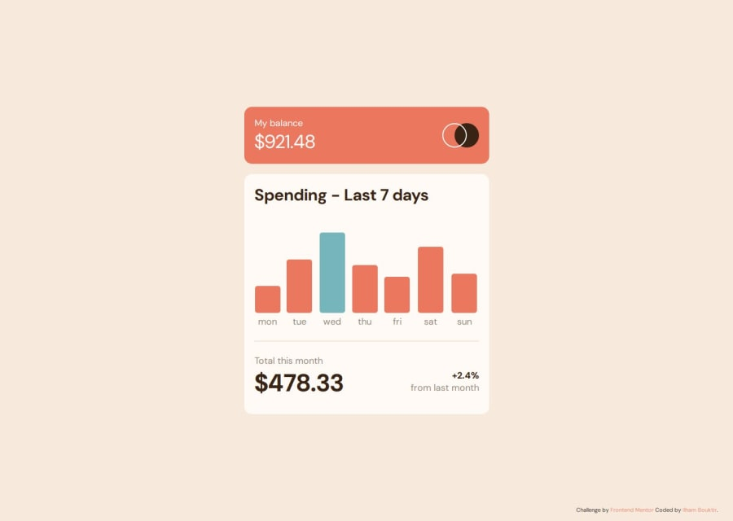

# Frontend Mentor - Expenses chart component solution

This is a solution to the [Expenses chart component challenge on Frontend Mentor](https://www.frontendmentor.io/challenges/expenses-chart-component-e7yJBUdjwt). Frontend Mentor challenges help improve coding skills by building realistic projects. 

## Table of contents

- [Overview](#overview)
  - [The challenge](#the-challenge)
  - [Screenshot](#screenshot)
  - [Links](#links)
- [My process](#my-process)
  - [Built with](#built-with)
  - [What I learned](#what-i-learned)
  - [Continued development](#continued-development)
- [Author](#author)
- [Acknowledgments](#acknowledgments)

## Overview

### The challenge

Users should be able to:

- View the bar chart and hover over the individual bars to see the correct amounts for each day
- See the current day’s bar highlighted in a different colour to the other bars
- View the optimal layout for the content depending on their device’s screen size
- See hover states for all interactive elements on the page
- **Bonus**: Use the JSON data file provided to dynamically size the bars on the chart

### Screenshot

### Links

- Solution URL: [Solution](https://www.frontendmentor.io/solutions/expenses-chart-component-solution-NoypN3LdUy)
- Live Site URL: [Live site](https://ilham-bouk.github.io/Expenses_chart_component/)

## My process

### Built with

- Semantic HTML5 markup
- CSS custom properties
- JavaScript 
- Flexbox
- CSS Grid
- Desktop-first workflow
- Fitch data from JSON file

### What I learned

This challenge provided valuable practice for my coding skills, especially in fetching JSON data and manipulating the DOM. 

### Continued development

I forgot to make the active class add dynamically to the current day, and I also want to include some animation

## Author

- Frontend Mentor - [@ilham-bouk](https://www.frontendmentor.io/profile/ilham-bouk)
- LinkedIn - [Ilham Bouktir](https://www.linkedin.com/in/ilham-bouktir-0b266b31b)

## Acknowledgments

A big thank you to anyone providing feedback on [my solution](https://www.frontendmentor.io/solutions/expenses-chart-component-solution-NoypN3LdUy). It definitely helps to find new ways to code and find easier solutions!

**Happy coding!** ☺️🚀 
